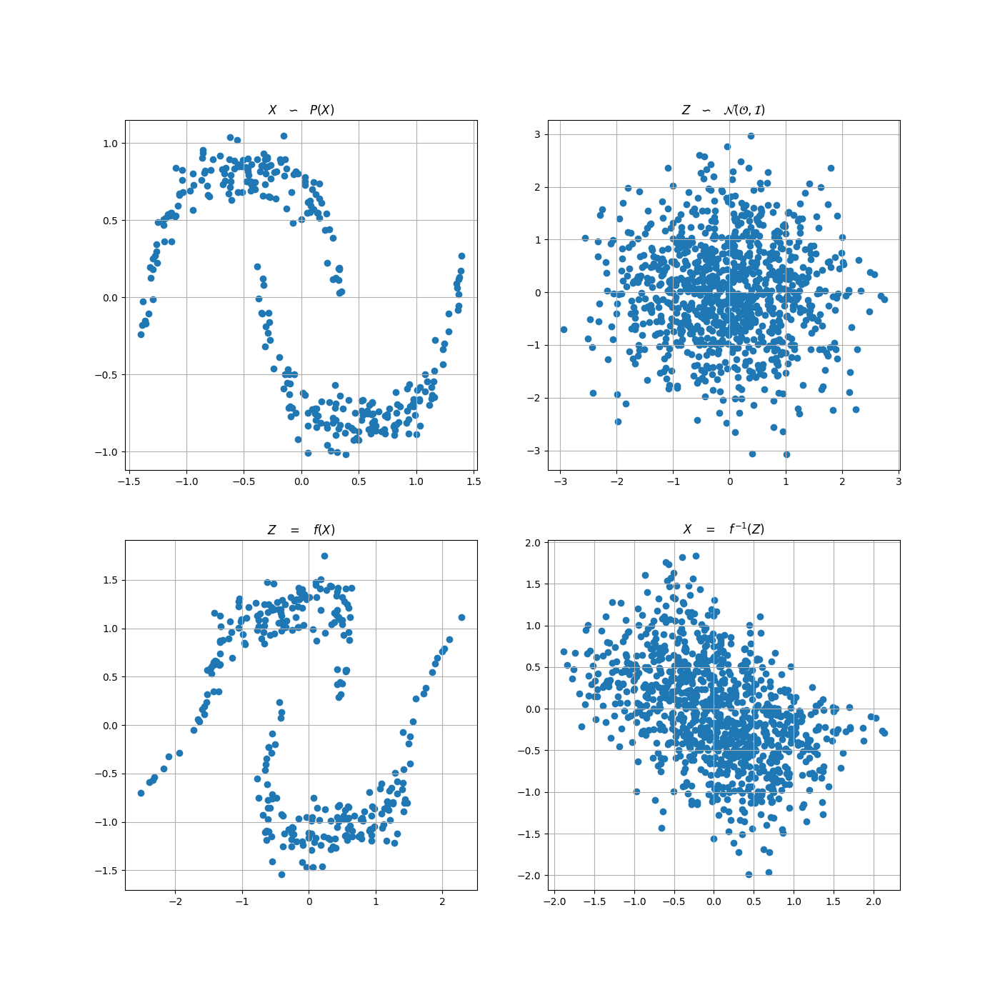
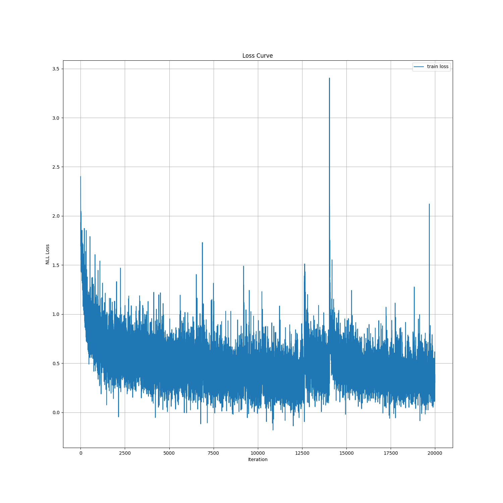

# Real-NVP
PyTorch Implementation of the paper 'Density Estimation Using Real NVP' (ICLR 2017)

### Requirements
* Python 3.6 >
* PyTorch 1.4 >

### Details
* Training : 0.07s per epoch on TITAN Xp
* 4 affine coupling layers with 2 hidden layers MLP
* batch size 32, Adam with lr 0.0001

### Results

  <em>After 1 epoch</em>
   
  
   
  <em>After 2000 epochs</em>
   
  

### Loss Curve

### References
[1] Dinh, Laurent, Jascha Sohl-Dickstein, and Samy Bengio. "Density estimation using real nvp." arXiv preprint arXiv:1605.08803 (2016). (ICLR 2017)

[2] Dinh, Laurent, David Krueger, and Yoshua Bengio. "Nice: Non-linear independent components estimation." arXiv preprint arXiv:1410.8516 (2014). (ICLR 2015)
